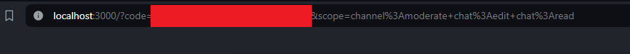
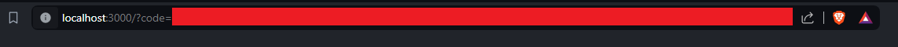

# Bot twitch

This is a bot that can be used in twitch chat. It is a simple bot that can be used to run commands in the chat.

## Installation

```bash
pip install -r requirements.txt
```

## Usage

```bash
python main.py
```

You have to have a file called `.env` in the directory that contains the following keys:

```env
CLIENT_ID= Id of the twitch application
CLIENT_SECRET= secret of the twitch application
TWITCH_NICK= Nickname of the bot (THIS IS NOT THE ONE THAT WILL BE SHOWN IN THE CHAT)
TWITCH_CHANNEL= Channel that the bot will join
BOT_PREFIX= Prefix that the bot will use to know that the message is a command

OSU_CLIENT_ID= Id of the osu application
OSU_CLIENT_SECRET= Secret of the osu application
```

For the first connection the program will ask you to enter the code that will be shown in the browser. After that the bot will be able to connect to the chat. Select the text agter code= until the & and paste it in the terminal.



## Osu

If you want to use the osu commands you have to input
```bash
python main.py -o scorval
```

or if you want to input an id instead of a name
```bash
python main.py -i id
```

The code will be after code= until the end generally.



## Commands

Commands can be found in the directory

```Bot/src/commands```, you can add, remove or patch commands by adding a file in this directory and adding in the `command.json` file or by using the combo web-ui/server.